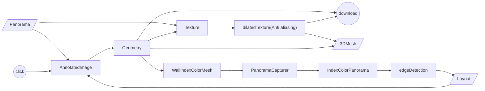
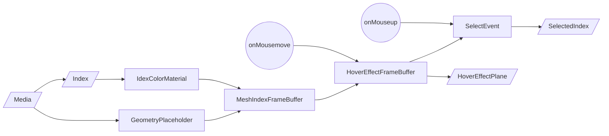

# Algorithms

Some technique details would be recorder in this document.

## Mesh and Texture

`three/components/PanoramaTextureMesh`

```mermaid
flowchart LR

    dilatedTexture["dilatedTexture(Anti aliasing)"]

    Panorama --> AnnotatedImage
    Panorama --> Texture

    user --> AnnotatedImage
    AnnotatedImage --> Geometry

    Geometry --> download

    Geometry --> Texture
    Texture --> dilatedTexture
    dilatedTexture --> download
    dilatedTexture --> 3DMesh
    Geometry --> 3DMesh

    Geometry --> WallIndexColorMesh
    WallIndexColorMesh --> PanoramaCapturer
    PanoramaCapturer --> IndexColorPanorama
    IndexColorPanorama --> edgeDetection
    edgeDetection --> Layout
    Layout --> AnnotatedImage

    Panorama[/Panorama/]
    3DMesh[/3DMesh/]
    Layout[/Layout/]
    user((click))
    download((download))
```

## GPU Objects Selector

`three/components/MeshIndexMap`

```mermaid
flowchart LR

    Media-->GeometryPlaceholder
    GeometryPlaceholder-->MeshIndexFrameBuffer
    Media-->Index
    Index-->IdexColorMaterial
    IdexColorMaterial-->MeshIndexFrameBuffer
    MeshIndexFrameBuffer-->HoverEffectFrameBuffer
    onMousemove-->HoverEffectFrameBuffer
    HoverEffectFrameBuffer-->SelectEvent
    HoverEffectFrameBuffer-->HoverEffectPlane
    onMouseup-->SelectEvent
    SelectEvent--> SelectedIndex

    Media[/Media/]
    Index[/Index/]
    SelectedIndex[/SelectedIndex/]
    HoverEffectPlane[/HoverEffectPlane/]
    onMousemove((onMousemove))
    onMouseup((onMouseup))
```
