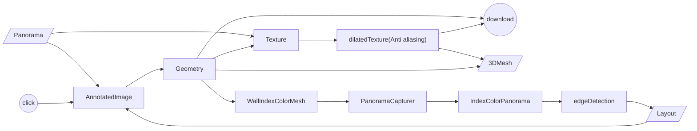

# Quick start

## Development with Yarn

```
yarn
yarn dev
```

## Production with Docker

### From Dockerfile

```
docker build . -t pano-to-mesh --no-cache
docker run -p 3000:3000 pano-to-mesh
```

### From Github Docker Registry

```
docker run -p 3000:3000 ghcr.io/yushiang-demo/pano-to-mesh
```

# Introduction

## Demo

- [Editor](https://pano-to-mesh.vercel.app/editor#eNpdkE9rwzAMxb-Lz8aWHP-Rcyyjt7WHwqCUENKsST0yJ6TptjL23ecUtrDp8EPiPaSHPlnT9f24ZzlwVp9CF2KbBpaJDBlnXXXrr5N6YPnhAALt38o4CEMuA1xY8GTUoAEdGYdazTSz0VtjgfQP70arwapZTY1CXHhXvXP23xYLhhTgL4uCs6GK_Vi9Vin2eZqGSy5ldUHRTPVzFPE0yTclX4ZWAkryEkg6kggA5bpE8kCOyJXb1dhlDaLbh3rwerc6r98fbx9P7XFjNk19FGkDW25tx9CGmN4CHEUKVnx9A-oPVjs)
- [Viewer](https://pano-to-mesh.vercel.app/#eNpdkE9rwzAMxb-Lz8aWHP-Rcyyjt7WHwqCUENKsST0yJ6TptjL23ecUtrDp8EPiPaSHPlnT9f24ZzlwVp9CF2KbBpaJDBlnXXXrr5N6YPnhAALt38o4CEMuA1xY8GTUoAEdGYdazTSz0VtjgfQP70arwapZTY1CXHhXvXP23xYLhhTgL4uCs6GK_Vi9Vin2eZqGSy5ldUHRTPVzFPE0yTclX4ZWAkryEkg6kggA5bpE8kCOyJXb1dhlDaLbh3rwerc6r98fbx9P7XFjNk19FGkDW25tx9CGmN4CHEUKVnx9A-oPVjs)


> Demo image is provided by:
> https://as1.ftcdn.net/v2/jpg/01/89/08/78/1000_F_189087887_OBrl3f117Yicp94SBhFwMyxVgbN5Nfcb.jpg

## Features

- Load panorama from local or url.
- Annotate layout from a panorama and preview 3D Mesh.
- Save 3D mesh and texture to local.
- Share result of viewer and editor with data embedded in URL.

## Algorithm

## Mesh and Texture


