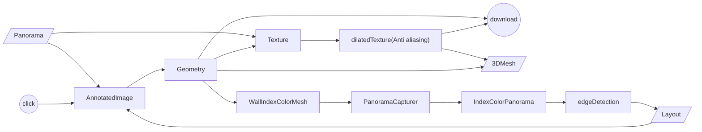

# Quick start

```
yarn
yarn dev
```

## Introduction

### Demo


> Demo image is provided by:
> https://as1.ftcdn.net/v2/jpg/01/89/08/78/1000_F_189087887_OBrl3f117Yicp94SBhFwMyxVgbN5Nfcb.jpg

### Features

- Load panorama from local and url.
- Annotate 3D layout from a panorama.
- Preview 3D mesh.
- Export 3D mesh and texture.

### Algorithm

Following flowchart describes how to get geometry layout and texture.


