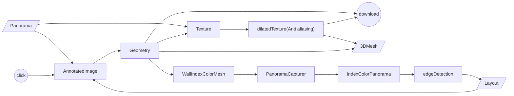

# Quick start

```
yarn
yarn dev
```

# Introduction

## Demo

- [Editor](https://pano-to-mesh.vercel.app/editor#eNqrVkrLyc8vilSyMtBRSk7NzMnMSwdyjHSUchIr80tLjFyUrKJjdZQKEvPyixJzE5WslJQQPP-izPTMPKAKAx1DPVMdg9haABJxGUo#eNpdkMtqwzAQRf9FayGNNJJG8jKU7JosCoUQjFHc2HFxbeOoj1D671W8qeniLGY43Hl8s6Yfx_nACuCsPnd9N7S5YChQMc76eBvfk35gxfEIQjm0zhOhRqMByHAQloxeU_IsBgrWYgBEY0mbcPcC4QqzeA6DAavBGAfBOcvvLcA1i_dPW-YGoBW-LDmb4jDO8S3m_S8pTddCynhVokn1yyCGc5IfWr5OrQQlfZDgJXmpAKDaVsrnDPKeqv1m7rFRig5dPQXztLlsPx9vX8_taWd3TX0SOYH9zdrPXdsN-T_AlcgHlD-_jHJYMQ)
- [Viewer](https://pano-to-mesh.vercel.app#eNqrVkrLyc8vilSyMtBRSk7NzMnMSwdyjHSUchIr80tLjFyUrKJjdZQKEvPyixJzE5WslJQQPP-izPTMPKAKAx1DPVMdg9haABJxGUo#eNpdkMtqwzAQRf9FayGNNJJG8jKU7JosCoUQjFHc2HFxbeOoj1D671W8qeniLGY43Hl8s6Yfx_nACuCsPnd9N7S5YChQMc76eBvfk35gxfEIQjm0zhOhRqMByHAQloxeU_IsBgrWYgBEY0mbcPcC4QqzeA6DAavBGAfBOcvvLcA1i_dPW-YGoBW-LDmb4jDO8S3m_S8pTddCynhVokn1yyCGc5IfWr5OrQQlfZDgJXmpAKDaVsrnDPKeqv1m7rFRig5dPQXztLlsPx9vX8_taWd3TX0SOYH9zdrPXdsN-T_AlcgHlD-_jHJYMQ)


> Demo image is provided by:
> https://as1.ftcdn.net/v2/jpg/01/89/08/78/1000_F_189087887_OBrl3f117Yicp94SBhFwMyxVgbN5Nfcb.jpg

## Features

- Load panorama from local or url.
- Annotate layout from a panorama and preview 3D Mesh.
- Save 3D mesh and texture to local.
- Share result of viewer and editor with data embedded in URL.

## Algorithm

## Mesh and Texture


