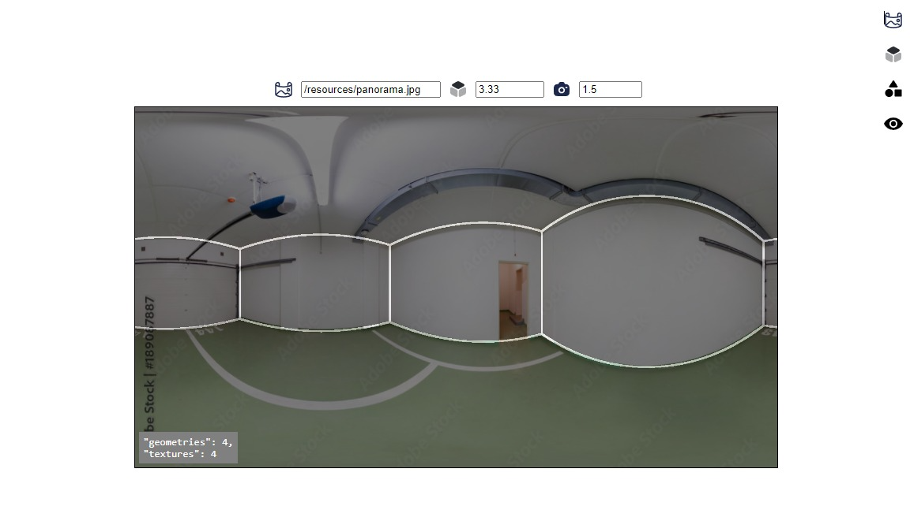
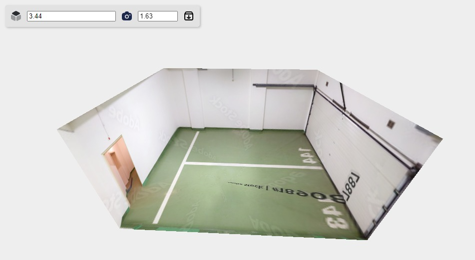
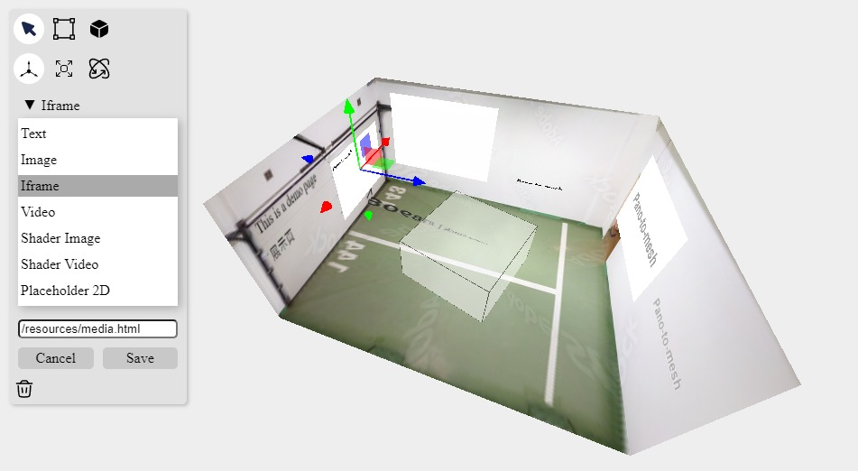
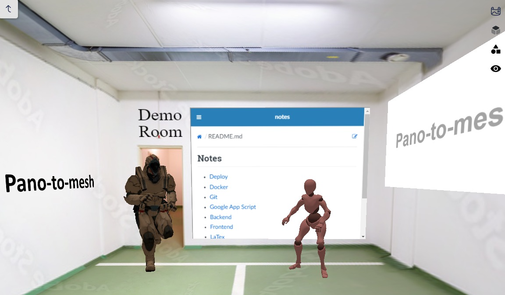

# Pano-to-mesh

Our tool simplifies 3D panorama creation. You can annotate layouts, preview 3D meshes, export them with textures, arrange your media, share a viewer link for collaboration, and also experience immersive interaction through a first-person view.

## Quick start

### Development

```
yarn
yarn dev
```

### Production

- From Dockerfile

```
docker build . -t pano-to-mesh --no-cache
docker run -p 3000:3000 pano-to-mesh
```

- From Github Docker Registry

```
docker run -p 3000:3000 ghcr.io/yushiang-demo/pano-to-mesh
```

## Features

- Annotate panorama layouts and preview 3D meshes.
- Export meshes and textures.
- Arrange media, including 3D meshes and HTML elements.
- Experience a first-person view and interact in the viewer.

|    [Panorama to mesh]    | [Mesh preview and download] |
| :----------------------: | :-------------------------: |
|  |     |

|    [Decoration with media]     |            [Viewer]             |
| :----------------------------: | :-----------------------------: |
|  |  |

> Demo image is provided by:
> https://as1.ftcdn.net/v2/jpg/01/89/08/78/1000_F_189087887_OBrl3f117Yicp94SBhFwMyxVgbN5Nfcb.jpg

[Panorama to mesh]: https://pano-to-mesh.vercel.app/editors/layout2d#eNrNl19vGzcQxL9Kcc-XM_8suaSf89KHokVSFC1co7jYZ1mtpFMlGagR-Lv3t1ITSJGdKIkLRBBki-LdcYczO8O3zbJfjKt-3jfnzdlqWI93q6thffZutPtzOWna95N-XE0n00VzfuFa36XWXbbNzWwcV781565trobpbLqY8KWJXYxcN-vvx7tNeMkVF67LMfoiKcTiqn22NuRC9c6l3We8bJkXa06q72a5GpmYqob913aiz6FKllCSej7zdmLRyvD793Zi1SIhZF-dKJ_2YJel-PfvdEkp8-F6Cg4Xb5vNql-sb8bVvN9MR-p92yzH9XT3_8UL37lSJGsNKhrE81zfFe9zjb5ahTGqtKFLOWjiq69KmUV4xPqqnw3cI3bOB599VldEVEtkvovBxSjM9S5w__Z4Frf4-67fDKvFbi2OUooLPCnzp7joom_dFq-csjKQxIG7XD60zeZ-ybObX6bXw8jmrIb-elzM7pvzm362Htrmut_0Vut6dXXIhi0w3XwpzcND-yl0qENYcpJaYmRZBXAkaSilGjo1ssb2BTvAN6pLxUnVHMsBOjGoyz55cdV5DTtwqnPFx1qSz7k9mvMc0Ly-7a-H1XdfgxAyGGfjqjln11Sp79OQUYpLmjOrrDH5IEq9vgSrqgT4rD4BmQELg6nZJ0215kM-MQAdIaYmJJNAHT4ml0SQhkguvj2edQzadmdAOEUH7QIbFraocQ3Q80sqNedU9lD7ft5Phi-Aa7mYnEAo6RxKK67kADIoxFpPVHQMvFFThGoMOYlVAjpJVdjgcAgOmpRATUg27aCBPIhTUWzNYnQ6nPMswPxHp6_B5wvoZLT3KpVqTIBarOBEj0SQjKM1FegUO2st1rZiSpn-eYCYZtopjbjkLHAow8iybZlwr9Lg6N4RWQNWTakgSAilj0nQR5_o47TxYMJLW8xq9cgxhZxrcjGHfTLdYDQnoHW72SzX52dnm_WwmNzfrW-n_WLSTaab27s33XQ8W4wbgDylYWE4ScU5oekG6kMooQsZr8p0L6mMBlNfxapctvaOVHM6gCvRwLxxoJZcIQYMg2ASksPBog-xGkVj0Wx3K-qpuzwHXD8P_2w-BtbGfj9vXg7z8ffFq3Gcn4IIbuZEos-IyUWhFVlDqhRWIjjhtIyw1iJmawVZ0r2C30PE2bqfoyP_NOuvhttxZjoiRzxd6UllVfHBGmhE--rj1qPFFeyVFMGgU9toUSlAr1GwX9RySl2fu2_PW1dBhSZVnkfgcBY-tFJqwCxrjUFYEIXhBoZxNhQ8qv72C9vuFDGuKFmLnEBhtZCQotHFw9KtMjG6gkk6lUxrTulbr8t1YiEmZUyLeFh2jq-0eCKrVxKS7loOQouKYSdhUb5-43WhL-eNdmJbVWiS1gfxZ6qg7zkXyTPYRsLIqdr6aMBK9qoSnD1hUuR04jqR0WAJ2QxXwYWWmtqjOY9adS2cDOjFmUhVS9lZtSdEizpvtshy_P_UaIKddCqHFJIIIcULj0Zv-y_xtuMQFlrTETFhQat7SHAPnCJTBquF7SKWeGEI8ZCaSG-ixyNHULASOh2wKZ5D3PGGjaVN5aQBRcgEduunBj-8eg-vH4b17WdlmtdgOx1W3WT2xlLNbLrk91d3i-aURCPwF2aH7YHQU4YhauRgvZhRxmA5PtZ4gKBgt4kYnZNdvUWc7BaZD0eLxbb2eNKHEIIC51IsAyAKO0X4cbahoAInYZJy0nGaHx86vvRrIPz1zbg5xG-9GPq__gAqS0yb6dxua3KvzSlyxSCUUwcLTLZWDgd7L-9qSweGwqTaoGonD866ewjTntV7zmRwkBRA-kXv5EMykp31yEIkqvZ41iMQE5oQOZkoVYuoamJlq4LpnIxanBb_xNiHlz6h6fhxTV8-_Avsc5U2
[Mesh preview and download]: https://pano-to-mesh.vercel.app/editors/layout3d#eNrNl19vGzcQxL9Kcc-XM_8suaSf89KHokVSFC1co7jYZ1mtpFMlGagR-Lv3t1ITSJGdKIkLRBBki-LdcYczO8O3zbJfjKt-3jfnzdlqWI93q6thffZutPtzOWna95N-XE0n00VzfuFa36XWXbbNzWwcV781565trobpbLqY8KWJXYxcN-vvx7tNeMkVF67LMfoiKcTiqn22NuRC9c6l3We8bJkXa06q72a5GpmYqob913aiz6FKllCSej7zdmLRyvD793Zi1SIhZF-dKJ_2YJel-PfvdEkp8-F6Cg4Xb5vNql-sb8bVvN9MR-p92yzH9XT3_8UL37lSJGsNKhrE81zfFe9zjb5ahTGqtKFLOWjiq69KmUV4xPqqnw3cI3bOB599VldEVEtkvovBxSjM9S5w__Z4Frf4-67fDKvFbi2OUooLPCnzp7joom_dFq-csjKQxIG7XD60zeZ-ybObX6bXw8jmrIb-elzM7pvzm362Htrmut_0Vut6dXXIhi0w3XwpzcND-yl0qENYcpJaYmRZBXAkaSilGjo1ssb2BTvAN6pLxUnVHMsBOjGoyz55cdV5DTtwqnPFx1qSz7k9mvMc0Ly-7a-H1XdfgxAyGGfjqjln11Sp79OQUYpLmjOrrDH5IEq9vgSrqgT4rD4BmQELg6nZJ0215kM-MQAdIaYmJJNAHT4ml0SQhkguvj2edQzadmdAOEUH7QIbFraocQ3Q80sqNedU9lD7ft5Phi-Aa7mYnEAo6RxKK67kADIoxFpPVHQMvFFThGoMOYlVAjpJVdjgcAgOmpRATUg27aCBPIhTUWzNYnQ6nPMswPxHp6_B5wvoZLT3KpVqTIBarOBEj0SQjKM1FegUO2st1rZiSpn-eYCYZtopjbjkLHAow8iybZlwr9Lg6N4RWQNWTakgSAilj0nQR5_o47TxYMJLW8xq9cgxhZxrcjGHfTLdYDQnoHW72SzX52dnm_WwmNzfrW-n_WLSTaab27s33XQ8W4wbgDylYWE4ScU5oekG6kMooQsZr8p0L6mMBlNfxapctvaOVHM6gCvRwLxxoJZcIQYMg2ASksPBog-xGkVj0Wx3K-qpuzwHXD8P_2w-BtbGfj9vXg7z8ffFq3Gcn4IIbuZEos-IyUWhFVlDqhRWIjjhtIyw1iJmawVZ0r2C30PE2bqfoyP_NOuvhttxZjoiRzxd6UllVfHBGmhE--rj1qPFFeyVFMGgU9toUSlAr1GwX9RySl2fu2_PW1dBhSZVnkfgcBY-tFJqwCxrjUFYEIXhBoZxNhQ8qv72C9vuFDGuKFmLnEBhtZCQotHFw9KtMjG6gkk6lUxrTulbr8t1YiEmZUyLeFh2jq-0eCKrVxKS7loOQouKYSdhUb5-43WhL-eNdmJbVWiS1gfxZ6qg7zkXyTPYRsLIqdr6aMBK9qoSnD1hUuR04jqR0WAJ2QxXwYWWmtqjOY9adS2cDOjFmUhVS9lZtSdEizpvtshy_P_UaIKddCqHFJIIIcULj0Zv-y_xtuMQFlrTETFhQat7SHAPnCJTBquF7SKWeGEI8ZCaSG-ixyNHULASOh2wKZ5D3PGGjaVN5aQBRcgEduunBj-8eg-vH4b17WdlmtdgOx1W3WT2xlLNbLrk91d3i-aURCPwF2aH7YHQU4YhauRgvZhRxmA5PtZ4gKBgt4kYnZNdvUWc7BaZD0eLxbb2eNKHEIIC51IsAyAKO0X4cbahoAInYZJy0nGaHx86vvRrIPz1zbg5xG-9GPq__gAqS0yb6dxua3KvzSlyxSCUUwcLTLZWDgd7L-9qSweGwqTaoGonD866ewjTntV7zmRwkBRA-kXv5EMykp31yEIkqvZ41iMQE5oQOZkoVYuoamJlq4LpnIxanBb_xNiHlz6h6fhxTV8-_Avsc5U2
[Decoration with media]: https://pano-to-mesh.vercel.app/editors/decoration#eNrNl19vGzcQxL9Kcc-XM_8suaSf89KHokVSFC1co7jYZ1mtpFMlGagR-Lv3t1ITSJGdKIkLRBBki-LdcYczO8O3zbJfjKt-3jfnzdlqWI93q6thffZutPtzOWna95N-XE0n00VzfuFa36XWXbbNzWwcV781565trobpbLqY8KWJXYxcN-vvx7tNeMkVF67LMfoiKcTiqn22NuRC9c6l3We8bJkXa06q72a5GpmYqob913aiz6FKllCSej7zdmLRyvD793Zi1SIhZF-dKJ_2YJel-PfvdEkp8-F6Cg4Xb5vNql-sb8bVvN9MR-p92yzH9XT3_8UL37lSJGsNKhrE81zfFe9zjb5ahTGqtKFLOWjiq69KmUV4xPqqnw3cI3bOB599VldEVEtkvovBxSjM9S5w__Z4Frf4-67fDKvFbi2OUooLPCnzp7joom_dFq-csjKQxIG7XD60zeZ-ybObX6bXw8jmrIb-elzM7pvzm362Htrmut_0Vut6dXXIhi0w3XwpzcND-yl0qENYcpJaYmRZBXAkaSilGjo1ssb2BTvAN6pLxUnVHMsBOjGoyz55cdV5DTtwqnPFx1qSz7k9mvMc0Ly-7a-H1XdfgxAyGGfjqjln11Sp79OQUYpLmjOrrDH5IEq9vgSrqgT4rD4BmQELg6nZJ0215kM-MQAdIaYmJJNAHT4ml0SQhkguvj2edQzadmdAOEUH7QIbFraocQ3Q80sqNedU9lD7ft5Phi-Aa7mYnEAo6RxKK67kADIoxFpPVHQMvFFThGoMOYlVAjpJVdjgcAgOmpRATUg27aCBPIhTUWzNYnQ6nPMswPxHp6_B5wvoZLT3KpVqTIBarOBEj0SQjKM1FegUO2st1rZiSpn-eYCYZtopjbjkLHAow8iybZlwr9Lg6N4RWQNWTakgSAilj0nQR5_o47TxYMJLW8xq9cgxhZxrcjGHfTLdYDQnoHW72SzX52dnm_WwmNzfrW-n_WLSTaab27s33XQ8W4wbgDylYWE4ScU5oekG6kMooQsZr8p0L6mMBlNfxapctvaOVHM6gCvRwLxxoJZcIQYMg2ASksPBog-xGkVj0Wx3K-qpuzwHXD8P_2w-BtbGfj9vXg7z8ffFq3Gcn4IIbuZEos-IyUWhFVlDqhRWIjjhtIyw1iJmawVZ0r2C30PE2bqfoyP_NOuvhttxZjoiRzxd6UllVfHBGmhE--rj1qPFFeyVFMGgU9toUSlAr1GwX9RySl2fu2_PW1dBhSZVnkfgcBY-tFJqwCxrjUFYEIXhBoZxNhQ8qv72C9vuFDGuKFmLnEBhtZCQotHFw9KtMjG6gkk6lUxrTulbr8t1YiEmZUyLeFh2jq-0eCKrVxKS7loOQouKYSdhUb5-43WhL-eNdmJbVWiS1gfxZ6qg7zkXyTPYRsLIqdr6aMBK9qoSnD1hUuR04jqR0WAJ2QxXwYWWmtqjOY9adS2cDOjFmUhVS9lZtSdEizpvtshy_P_UaIKddCqHFJIIIcULj0Zv-y_xtuMQFlrTETFhQat7SHAPnCJTBquF7SKWeGEI8ZCaSG-ixyNHULASOh2wKZ5D3PGGjaVN5aQBRcgEduunBj-8eg-vH4b17WdlmtdgOx1W3WT2xlLNbLrk91d3i-aURCPwF2aH7YHQU4YhauRgvZhRxmA5PtZ4gKBgt4kYnZNdvUWc7BaZD0eLxbb2eNKHEIIC51IsAyAKO0X4cbahoAInYZJy0nGaHx86vvRrIPz1zbg5xG-9GPq__gAqS0yb6dxua3KvzSlyxSCUUwcLTLZWDgd7L-9qSweGwqTaoGonD866ewjTntV7zmRwkBRA-kXv5EMykp31yEIkqvZ41iMQE5oQOZkoVYuoamJlq4LpnIxanBb_xNiHlz6h6fhxTV8-_Avsc5U2
[Viewer]: https://pano-to-mesh.vercel.app/#eNrNl19vGzcQxL9Kcc-XM_8suaSf89KHokVSFC1co7jYZ1mtpFMlGagR-Lv3t1ITSJGdKIkLRBBki-LdcYczO8O3zbJfjKt-3jfnzdlqWI93q6thffZutPtzOWna95N-XE0n00VzfuFa36XWXbbNzWwcV781565trobpbLqY8KWJXYxcN-vvx7tNeMkVF67LMfoiKcTiqn22NuRC9c6l3We8bJkXa06q72a5GpmYqob913aiz6FKllCSej7zdmLRyvD793Zi1SIhZF-dKJ_2YJel-PfvdEkp8-F6Cg4Xb5vNql-sb8bVvN9MR-p92yzH9XT3_8UL37lSJGsNKhrE81zfFe9zjb5ahTGqtKFLOWjiq69KmUV4xPqqnw3cI3bOB599VldEVEtkvovBxSjM9S5w__Z4Frf4-67fDKvFbi2OUooLPCnzp7joom_dFq-csjKQxIG7XD60zeZ-ybObX6bXw8jmrIb-elzM7pvzm362Htrmut_0Vut6dXXIhi0w3XwpzcND-yl0qENYcpJaYmRZBXAkaSilGjo1ssb2BTvAN6pLxUnVHMsBOjGoyz55cdV5DTtwqnPFx1qSz7k9mvMc0Ly-7a-H1XdfgxAyGGfjqjln11Sp79OQUYpLmjOrrDH5IEq9vgSrqgT4rD4BmQELg6nZJ0215kM-MQAdIaYmJJNAHT4ml0SQhkguvj2edQzadmdAOEUH7QIbFraocQ3Q80sqNedU9lD7ft5Phi-Aa7mYnEAo6RxKK67kADIoxFpPVHQMvFFThGoMOYlVAjpJVdjgcAgOmpRATUg27aCBPIhTUWzNYnQ6nPMswPxHp6_B5wvoZLT3KpVqTIBarOBEj0SQjKM1FegUO2st1rZiSpn-eYCYZtopjbjkLHAow8iybZlwr9Lg6N4RWQNWTakgSAilj0nQR5_o47TxYMJLW8xq9cgxhZxrcjGHfTLdYDQnoHW72SzX52dnm_WwmNzfrW-n_WLSTaab27s33XQ8W4wbgDylYWE4ScU5oekG6kMooQsZr8p0L6mMBlNfxapctvaOVHM6gCvRwLxxoJZcIQYMg2ASksPBog-xGkVj0Wx3K-qpuzwHXD8P_2w-BtbGfj9vXg7z8ffFq3Gcn4IIbuZEos-IyUWhFVlDqhRWIjjhtIyw1iJmawVZ0r2C30PE2bqfoyP_NOuvhttxZjoiRzxd6UllVfHBGmhE--rj1qPFFeyVFMGgU9toUSlAr1GwX9RySl2fu2_PW1dBhSZVnkfgcBY-tFJqwCxrjUFYEIXhBoZxNhQ8qv72C9vuFDGuKFmLnEBhtZCQotHFw9KtMjG6gkk6lUxrTulbr8t1YiEmZUyLeFh2jq-0eCKrVxKS7loOQouKYSdhUb5-43WhL-eNdmJbVWiS1gfxZ6qg7zkXyTPYRsLIqdr6aMBK9qoSnD1hUuR04jqR0WAJ2QxXwYWWmtqjOY9adS2cDOjFmUhVS9lZtSdEizpvtshy_P_UaIKddCqHFJIIIcULj0Zv-y_xtuMQFlrTETFhQat7SHAPnCJTBquF7SKWeGEI8ZCaSG-ixyNHULASOh2wKZ5D3PGGjaVN5aQBRcgEduunBj-8eg-vH4b17WdlmtdgOx1W3WT2xlLNbLrk91d3i-aURCPwF2aH7YHQU4YhauRgvZhRxmA5PtZ4gKBgt4kYnZNdvUWc7BaZD0eLxbb2eNKHEIIC51IsAyAKO0X4cbahoAInYZJy0nGaHx86vvRrIPz1zbg5xG-9GPq__gAqS0yb6dxua3KvzSlyxSCUUwcLTLZWDgd7L-9qSweGwqTaoGonD866ewjTntV7zmRwkBRA-kXv5EMykp31yEIkqvZ41iMQE5oQOZkoVYuoamJlq4LpnIxanBb_xNiHlz6h6fhxTV8-_Avsc5U2
