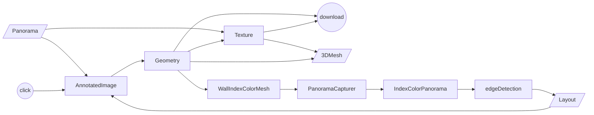

# Quick start

```
yarn setup
yarn dev
```

# Algorithm

Following flowchart describes how to get geometry layout and texture.


```mermaid
flowchart LR

    Panorama --> AnnotatedImage
    Panorama --> Texture

    user --> AnnotatedImage
    AnnotatedImage --> Geometry

    Geometry --> download
    Texture --> download

    Geometry --> Texture
    Texture --> 3DMesh
    Geometry --> 3DMesh

    Geometry --> WallIndexColorMesh
    WallIndexColorMesh --> PanoramaCapturer
    PanoramaCapturer --> IndexColorPanorama
    IndexColorPanorama --> edgeDetection
    edgeDetection --> Layout
    Layout --> AnnotatedImage

    Panorama[/Panorama/]
    3DMesh[/3DMesh/]
    Layout[/Layout/]
    user((click))
    download((download))
```
